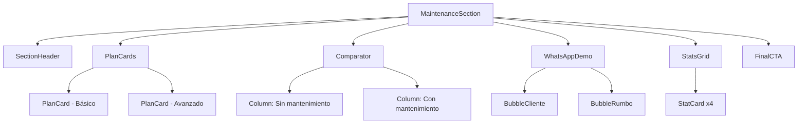

# Documento de Diseño: Mantenimiento Mensual

## Overview

La sección **Mantenimiento Mensual** es un componente React de cliente (`"use client"`) que se inserta en la página principal de Rumbo Digital Studio entre `PlansSection` y `BudgetCalculator`. Su propósito es convertir visitantes en clientes de planes recurrentes, comunicando tranquilidad, soporte continuo y profesionalismo.

La sección está compuesta por seis bloques visuales en secuencia vertical:

1. **Encabezado** — título, subtítulo e íconos decorativos
2. **Tarjetas de planes** — Plan Básico y Plan Avanzado con precios, beneficios y CTAs
3. **Comparador** — contraste lado a lado entre "Sin mantenimiento" y "Con mantenimiento"
4. **WhatsApp Demo** — conversación simulada que ilustra la simplicidad del soporte
5. **Stats Grid** — cuatro tarjetas de beneficios clave
6. **CTA Final** — llamado a la acción con dos botones de conversión

Todas las animaciones usan Framer Motion con el patrón `whileInView` + `viewport={{ once: true }}` que se emplea en el resto del sitio. Todos los estilos respetan el Design System definido en `tailwind.config.ts`.

---

## Architecture

### Ubicación en el árbol de componentes

```
app/page.tsx (Server Component)
  └── <main>
        ├── <HeroSection />
        ├── <ProjectsSection />
        ├── <ServicesSection />
        ├── <HowWeWorkSection />
        ├── <PlansSection />           ← sección anterior
        ├── <MaintenanceSection />     ← NUEVO (posición exacta)
        ├── <BudgetCalculator />       ← sección siguiente
        ├── <TestimonialsSection />
        ├── <FAQSection />
        └── <ContactSection />
```

### Estrategia de datos

Los datos de planes, comparador, stats y mensajes de WhatsApp son **hardcodeados** dentro del propio componente como constantes TypeScript. No requieren fetch a PocketBase ni ninguna fuente externa, dado que los requisitos especifican contenido fijo.

### Diagrama de subcomponentes



---

## Components and Interfaces

### `MaintenanceSection` (componente raíz)

```tsx
// components/sections/MaintenanceSection.tsx
"use client";

export function MaintenanceSection(): JSX.Element
```

- Elemento raíz: `<section id="mantenimiento" className="py-24 bg-background">`
- Contiene decoración de fondo con blobs animados (igual que `HeroSection`).
- No acepta props — todos los datos son constantes internas.

### Constantes de datos internas

```ts
// Planes de mantenimiento
const MAINTENANCE_PLANS: MaintenancePlan[] = [
  {
    id: "basico",
    name: "Plan Básico",
    price: 7900,
    period: "mes",
    currency: "ARS",
    description: "Ideal para quienes solo quieren mantener su sitio funcionando sin preocupaciones.",
    highlighted: false,
    badge: null,
    ctaLabel: "Contratar",
    features: [
      "Hosting incluido",
      "Dominio incluido",
      "Certificado SSL",
      "Copias de seguridad automáticas",
      "Monitoreo del sitio",
      "Corrección de errores",
      "Soporte por WhatsApp",
      "Hasta 2 cambios pequeños por mes",
      "Tiempo de respuesta estándar",
    ],
  },
  {
    id: "avanzado",
    name: "Plan Avanzado",
    price: 24900,
    period: "mes",
    currency: "ARS",
    description: "Ideal para negocios que actualizan constantemente su página y quieren olvidarse completamente de la parte técnica.",
    highlighted: true,
    badge: "⭐ Más elegido",
    ctaLabel: "Quiero este plan",
    features: [
      "Hosting incluido",
      "Dominio incluido",
      "Certificado SSL",
      "Copias de seguridad automáticas",
      "Monitoreo del sitio",
      "Corrección de errores",
      "Soporte por WhatsApp",
      "Cambios de contenido prácticamente ilimitados",
      "Nuevas secciones simples",
      "Prioridad en soporte",
      "Optimización continua",
      "Ajustes de diseño",
      "Revisión mensual del sitio",
      "Recomendaciones para mejorar conversión",
      "Atención rápida por WhatsApp",
    ],
  },
];

// Comparador
const COMPARATOR_WITHOUT = [
  "Si querés cambiar un horario tenés que pedir un presupuesto",
  "Si cambia un precio hay que solicitar una modificación",
  "Si aparece un error nadie lo controla",
  "Tu página queda desactualizada",
];
const COMPARATOR_WITH = [
  "Nos escribís por WhatsApp",
  "Nosotros realizamos el cambio",
  "Tu sitio siempre actualizado",
  "Soporte continuo",
];

// Stats
const STATS = [
  { id: "respuesta",   label: "⚡ Respuesta rápida" },
  { id: "soporte",     label: "🛠 Soporte continuo" },
  { id: "seguridad",   label: "🔒 Sitio seguro" },
  { id: "monitoreo",   label: "🌐 Monitoreo permanente" },
];

// WhatsApp Demo
const WHATSAPP_MESSAGES: WhatsAppMessage[] = [
  {
    sender: "client",
    text: "Hola, mañana lanzamos una promoción del 20%. ¿Podés agregar un banner en la página?",
  },
  {
    sender: "studio",
    text: "¡Listo! Ya está publicado. Mucha suerte con la promoción.",
  },
];
```

### Interfaces TypeScript

```ts
interface MaintenancePlan {
  id: string;
  name: string;
  price: number;
  period: string;
  currency: string;
  description: string;
  highlighted: boolean;
  badge: string | null;
  ctaLabel: string;
  features: string[];
}

interface WhatsAppMessage {
  sender: "client" | "studio";
  text: string;
}
```

---

## Data Models

Al no existir integración con base de datos, los modelos de datos son puramente las interfaces TypeScript definidas arriba. El componente es completamente autocontenido.

La función `formatPrice` importada de `@/lib/utils` (ya existente en el proyecto) se reutiliza para mostrar los precios con formato consistente (`$7.900`).

---

## Correctness Properties

*Una propiedad es una característica o comportamiento que debe ser verdadero en todas las ejecuciones válidas de un sistema — esencialmente, una declaración formal sobre lo que el sistema debe hacer. Las propiedades sirven como puente entre especificaciones legibles por humanos y garantías de corrección verificables automáticamente.*

---

### Property 1: Completitud de características de los planes

*Para cualquier* plan de mantenimiento definido (Básico o Avanzado) y para cualquier ítem de la lista `features` de ese plan, el componente renderizado SHALL contener ese texto dentro de la tarjeta del plan correspondiente.

**Validates: Requirements 2.2, 2.3**

---

### Property 2: Completitud de ítems del comparador

*Para cualquier* columna del comparador (`COMPARATOR_WITHOUT` y `COMPARATOR_WITH`) y para cualquier ítem definido en esa columna, el componente renderizado SHALL mostrar ese ítem en la columna correcta.

**Validates: Requirements 3.2, 3.3**

---

### Property 3: Alineación de burbujas de WhatsApp según remitente

*Para cualquier* mensaje en la lista `WHATSAPP_MESSAGES`, los mensajes con `sender === "client"` SHALL renderizarse alineados a la izquierda (`justify-start` o `self-start`) y los mensajes con `sender === "studio"` SHALL renderizarse alineados a la derecha (`justify-end` o `self-end`), sin importar el contenido del texto.

**Validates: Requirements 4.3**

---

### Property 4: Renderizado completo del Stats Grid con estilos glassmorphism

*Para cualquier* ítem en el array `STATS`, el componente renderizado SHALL mostrar una tarjeta con el texto del ítem que contenga las clases CSS `bg-background-card` y `border` del Design System.

**Validates: Requirements 5.1, 5.2**

---

### Property 5: Layout responsivo de una columna en mobile

*Para cualquier* viewport con ancho inferior a 768px (breakpoint `md`), las grillas de tarjetas de planes y el comparador SHALL colapsar a una sola columna, usando la clase Tailwind `grid-cols-1` en los contenedores afectados.

**Validates: Requirements 8.4**

---

## Error Handling

Dado que el componente es completamente estático (sin fetch, sin estado dinámico externo), los casos de error son acotados:

| Escenario | Comportamiento esperado |
|-----------|------------------------|
| `formatPrice` recibe un valor no numérico | La función de utilidad ya existente maneja este caso; los valores están hardcodeados por lo que no puede ocurrir en producción |
| El enlace de WhatsApp CTA es inválido | El href a `#contacto` es un string literal, no puede fallar |
| Framer Motion no está disponible | Next.js incluye Framer Motion como dependencia; el error es de build, no de runtime |
| Hydration mismatch | El componente tiene `"use client"` y no usa APIs del servidor, por lo que no hay riesgo de mismatch |

No se necesita manejo de errores en runtime. Los únicos casos de fallo son errores de build/compilación que se detectan al ejecutar `next build`.

---

## Testing Strategy

### Enfoque dual: tests de ejemplo + tests basados en propiedades

El componente es una función de renderizado React con datos hardcodeados. Algunos aspectos son verificables como **propiedades universales** (para cualquier ítem del array X, la condición Y debe cumplirse), lo que hace que la herramienta apropiada sea una librería de property-based testing.

**Librería elegida:** [fast-check](https://fast-check.io/) — el estándar de facto para PBT en TypeScript/JavaScript.

**Runner de tests:** [Vitest](https://vitest.dev/) con `@testing-library/react` para renderizado de componentes.

**Configuración mínima:** 100 iteraciones por property test (default de fast-check).

---

### Tests de Ejemplo (unitarios)

Estos tests verifican comportamientos concretos y únicos que no varían con el input:

| Test | Criterio validado |
|------|------------------|
| El título "Mantenimiento mensual" está presente | Req 1.1 |
| El subtítulo exacto está presente | Req 1.2 |
| Los íconos decorativos (Server, Cloud, Shield, Settings, Activity) están presentes | Req 1.3 |
| Exactamente 2 tarjetas de plan son renderizadas | Req 2.1 |
| El Plan Avanzado tiene el badge "⭐ Más elegido" y clase `border-primary-500` | Req 2.4 |
| El botón CTA del Plan Básico tiene el texto "Contratar" | Req 2.5 |
| El botón CTA del Plan Avanzado tiene el texto "Quiero este plan" | Req 2.6 |
| Los encabezados de columna "Sin mantenimiento" y "Con mantenimiento" están presentes | Req 3.1 |
| El título "¿Cómo funciona?" está presente | Req 4.1 |
| Los textos exactos de ambas burbujas de WhatsApp están presentes | Req 4.2 |
| El texto de cierre de la WhatsApp Demo está presente | Req 4.4 |
| El CTA Final muestra el título y subtítulo exactos | Req 6.1 |
| El botón principal tiene el texto correcto y la clase `bg-primary-600` | Req 6.2 |
| El botón secundario tiene el texto correcto y la clase `bg-glass` | Req 6.3 |
| El elemento `<section>` raíz tiene `id="mantenimiento"` | Req 7.3 |
| El elemento `<section>` raíz tiene la clase `bg-background` | Req 8.1 |
| Los elementos de blob decorativos están presentes con `animate-blob` | Req 8.5 |

---

### Tests Basados en Propiedades

Cada test de propiedad usa fast-check con mínimo 100 iteraciones. Se etiqueta con el nombre del feature y el número de propiedad del documento.

#### Propiedad 1 — Completitud de características de los planes

```ts
// Feature: mantenimiento-mensual, Property 1: Plan features completeness
it.prop([fc.constantFrom(...MAINTENANCE_PLANS), fc.nat()])(
  "cada característica de un plan aparece en la tarjeta renderizada",
  (plan, featureIndexSeed) => {
    const featureIndex = featureIndexSeed % plan.features.length;
    const feature = plan.features[featureIndex];
    const { getByText } = render(<MaintenanceSection />);
    expect(getByText(feature)).toBeTruthy();
  }
);
```

#### Propiedad 2 — Completitud de ítems del comparador

```ts
// Feature: mantenimiento-mensual, Property 2: Comparator items completeness
it.prop([
  fc.constantFrom(...[
    ...COMPARATOR_WITHOUT.map(text => ({ text, column: "sin" as const })),
    ...COMPARATOR_WITH.map(text => ({ text, column: "con" as const })),
  ])
])(
  "cada ítem del comparador aparece en el HTML renderizado",
  ({ text }) => {
    const { getByText } = render(<MaintenanceSection />);
    expect(getByText(text)).toBeTruthy();
  }
);
```

#### Propiedad 3 — Alineación de burbujas WhatsApp

```ts
// Feature: mantenimiento-mensual, Property 3: WhatsApp bubble alignment
it.prop([fc.constantFrom(...WHATSAPP_MESSAGES)])(
  "los mensajes del cliente están alineados a la izquierda y los del studio a la derecha",
  (message) => {
    const { getByText } = render(<MaintenanceSection />);
    const bubble = getByText(message.text).closest("[data-testid='whatsapp-bubble']");
    if (message.sender === "client") {
      expect(bubble).toHaveClass("self-start");
    } else {
      expect(bubble).toHaveClass("self-end");
    }
  }
);
```

#### Propiedad 4 — Renderizado completo del Stats Grid

```ts
// Feature: mantenimiento-mensual, Property 4: Stats grid completeness and glassmorphism
it.prop([fc.constantFrom(...STATS)])(
  "cada stat item aparece en una tarjeta con clases glassmorphism",
  (stat) => {
    const { getByText } = render(<MaintenanceSection />);
    const card = getByText(stat.label).closest("[data-testid='stat-card']");
    expect(card).toHaveClass("bg-background-card");
    expect(card).toHaveClass("border");
  }
);
```

#### Propiedad 5 — Layout responsivo en mobile

```ts
// Feature: mantenimiento-mensual, Property 5: Responsive single-column layout on mobile
// Esta propiedad se verifica inspeccionando las clases Tailwind aplicadas al contenedor de la grilla.
// En Tailwind, "grid-cols-1 md:grid-cols-2" garantiza una sola columna por debajo de 768px.
it.prop([fc.constant(null)])(
  "el contenedor de tarjetas de planes usa grid-cols-1 como clase base (mobile-first)",
  () => {
    const { container } = render(<MaintenanceSection />);
    const plansGrid = container.querySelector("[data-testid='plans-grid']");
    expect(plansGrid?.className).toMatch(/grid-cols-1/);
  }
);
```

---

### Cobertura objetivo

| Bloque | Tests de ejemplo | Tests de propiedad | Total |
|--------|-----------------|-------------------|-------|
| Encabezado | 3 | 0 | 3 |
| Tarjetas de planes | 5 | 1 (100 iter.) | 6 |
| Comparador | 1 | 1 (100 iter.) | 2 |
| WhatsApp Demo | 3 | 1 (100 iter.) | 4 |
| Stats Grid | 0 | 1 (100 iter.) | 1 |
| CTA Final | 3 | 0 | 3 |
| Integración / estructura | 3 | 1 (100 iter.) | 4 |
| **Total** | **18** | **5** | **23** |

---

## Notas de Implementación

### Reutilización de patrones existentes

El diseño sigue exactamente los mismos patrones que `PlansSection.tsx`:

- `motion.div` con `initial={{ opacity: 0, y: 20 }}` + `whileInView={{ opacity: 1, y: 0 }}` + `viewport={{ once: true }}`
- Stagger con `transition={{ delay: index * 0.15 }}`
- Tarjeta destacada con `border-primary-500`, `shadow-glow-lg`, `scale-105`
- Badge posicionado con `absolute -top-4 left-1/2 -translate-x-1/2`
- Botón primario: `bg-primary-600 hover:bg-primary-700 text-white shadow-glow`
- Botón secundario: `bg-glass hover:bg-glass-strong border border-border text-white`
- Glassmorphism: `bg-background-card border border-border`

### WhatsApp CTA href

El href de WhatsApp para los botones CTA sigue el mismo patrón del `BudgetCalculator.tsx`:

```
https://wa.me/5402920245637?text=<mensaje_codificado>
```

Los botones de plan usan un mensaje genérico que indica el plan elegido. El fallback es `#contacto`.

### Blobs de fondo

Se usan los mismos blobs del `HeroSection.tsx`:

```tsx
<div className="absolute top-1/4 right-1/4 w-96 h-96 bg-primary-500/20 rounded-full blur-3xl animate-blob" />
<div className="absolute bottom-1/4 left-1/4 w-96 h-96 bg-secondary-500/20 rounded-full blur-3xl animate-blob-slow" />
```

### Accesibilidad

- Todos los íconos decorativos de Lucide tienen `aria-hidden="true"` dado que son puramente decorativos.
- Las burbujas de WhatsApp usan `role="article"` con un `aria-label` descriptivo.
- Los botones CTA tienen texto descriptivo suficiente (sin necesidad de `aria-label` adicional).
- La sección tiene `id="mantenimiento"` para navegación por ancla accesible.
