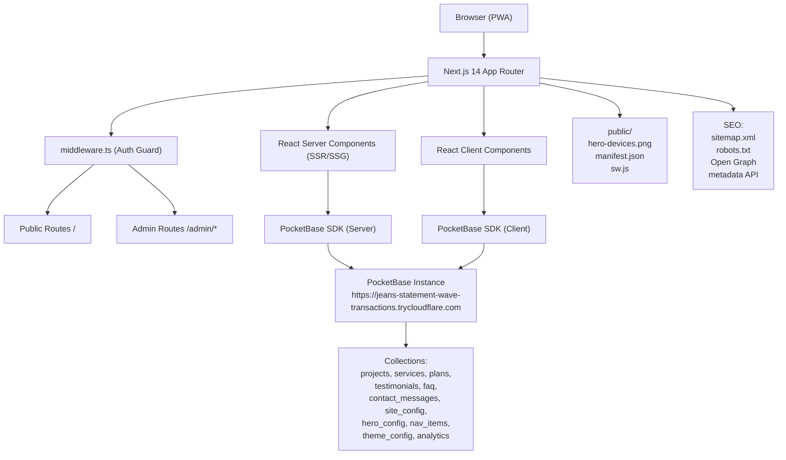
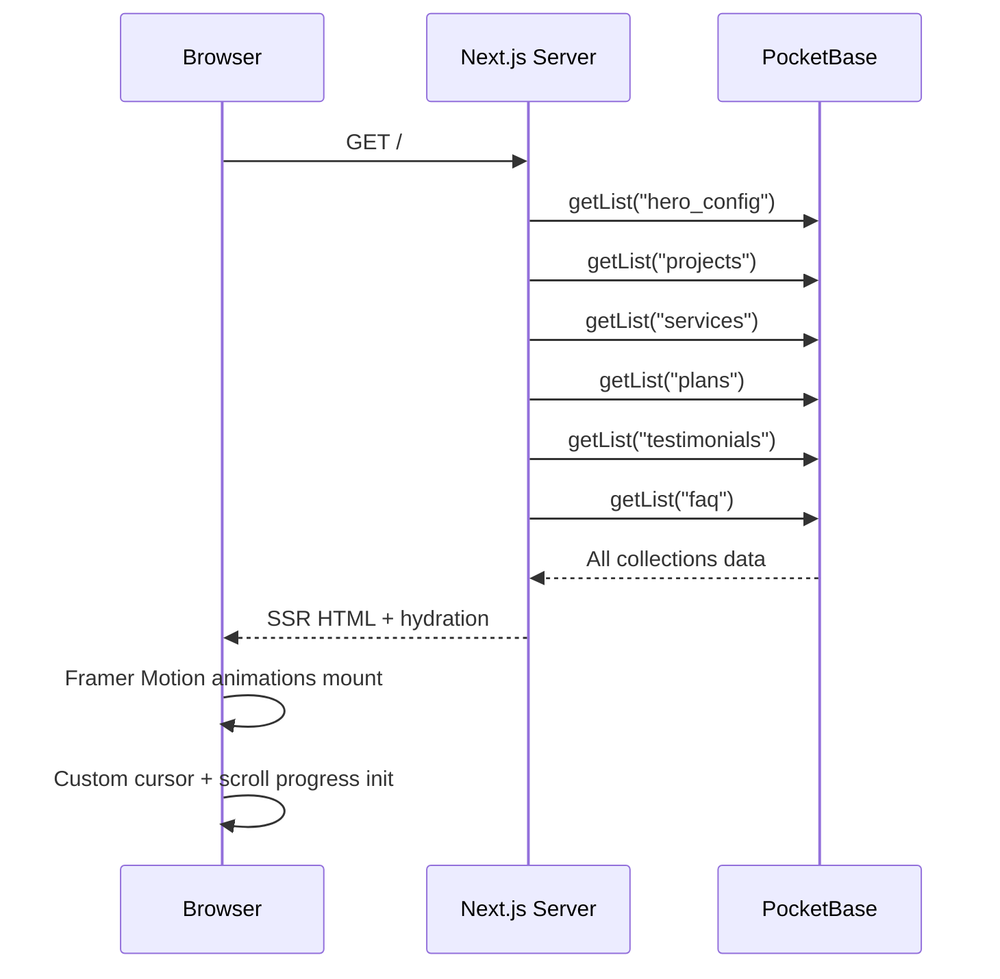
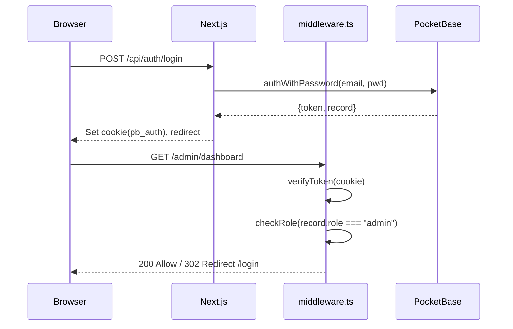
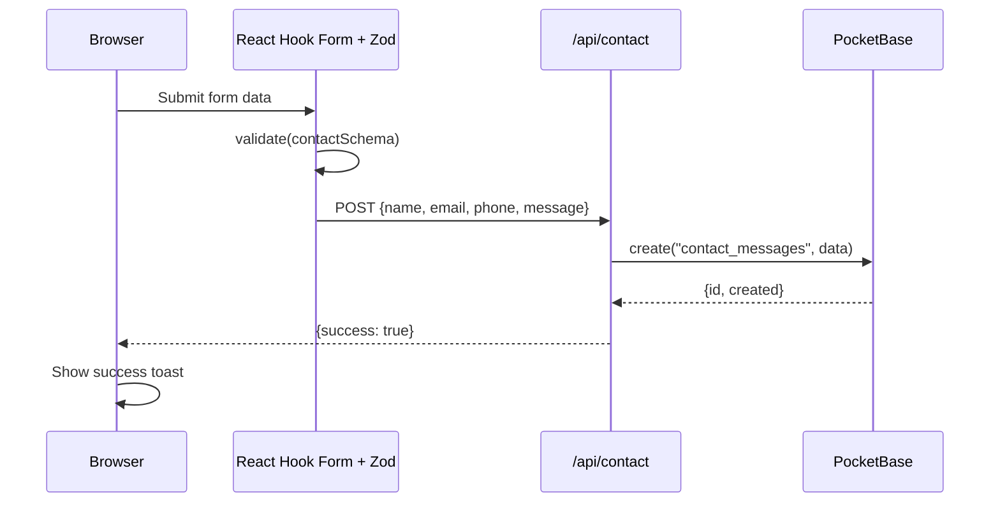

# Design Document: Rumbo Digital Studio

## Overview

Rumbo Digital Studio es una agencia de desarrollo web con presencia digital completa. La plataforma es un sitio web de una sola página (landing) con secciones animadas, panel de administración CMS, autenticación JWT con roles, y conexión en tiempo real a PocketBase como backend. El stack es Next.js 14 App Router + TypeScript + Tailwind CSS + Framer Motion, con diseño dark/glassmorphism, PWA y Lighthouse 90+.

La arquitectura combina un frontend Next.js renderizado en servidor (SSR/SSG) con un backend PocketBase alojado externamente. El admin panel vive en la ruta `/admin` protegida por middleware de Next.js. Los datos de contenido (proyectos, servicios, planes, testimonios, FAQ) se gestionan desde PocketBase y se consumen vía el SDK oficial. Los mensajes de contacto y analytics se persisten en colecciones PocketBase.


## Architecture




## Sequence Diagrams

### Carga inicial de la landing page



### Flujo de autenticación



### Envío de formulario de contacto




## Components and Interfaces

### Component 1: Navbar

**Purpose**: Barra de navegación fija con blur glassmorphism, cambio visual en scroll, logo, links y CTA.

**Interface**:
```typescript
interface NavbarProps {
  items: NavItem[]
  ctaLabel: string
  ctaHref: string
}

interface NavItem {
  id: string
  label: string
  href: string
  order: number
}
```

**Responsibilities**:
- Detectar scroll y aplicar `backdrop-blur` + cambio de opacidad
- Renderizar links activos según hash/ruta actual
- Mostrar menú hamburguesa en mobile
- Smooth scroll a secciones al hacer clic

### Component 2: HeroSection

**Purpose**: Sección principal con título animado, CTA buttons, imagen hero-devices.png, partículas y efecto parallax.

**Interface**:
```typescript
interface HeroConfig {
  id: string
  title: string
  subtitle: string
  ctaPrimaryLabel: string
  ctaPrimaryHref: string
  ctaSecondaryLabel: string
  ctaSecondaryHref: string
  badgeText?: string
}

interface HeroSectionProps {
  config: HeroConfig
}
```

**Responsibilities**:
- Renderizar título con animación de entrada Framer Motion (stagger children)
- Mostrar imagen `hero-devices.png` con efecto parallax en scroll
- Generar partículas animadas con canvas o CSS
- Blob animations en background

### Component 3: ProjectsSection

**Purpose**: Grid/lista de proyectos con filtro por categoría, buscador, favoritos (localStorage) y datos desde PocketBase.

**Interface**:
```typescript
interface Project {
  id: string
  name: string
  description: string
  category: string
  technologies: string[]
  imageUrl: string
  demoUrl?: string
  repoUrl?: string
  featured: boolean
}

interface ProjectsSectionProps {
  initialProjects: Project[]
}
```

**Responsibilities**:
- Filtrar proyectos por categoría con animación de re-layout (Framer Motion layoutId)
- Buscador con debounce sobre nombre/descripción
- Toggle lista/grid con persistencia en localStorage
- Favoritos guardados en localStorage
- Cards con hover 3D tilt effect

### Component 4: ServicesSection

**Purpose**: Grid de 13 servicios con iconos animados, descripciones y datos desde PocketBase.

**Interface**:
```typescript
interface Service {
  id: string
  name: string
  description: string
  icon: string
  color: string
  order: number
}

interface ServicesSectionProps {
  services: Service[]
}
```

**Responsibilities**:
- Renderizar cards con Lucide icons + animación hover
- Stagger animation al entrar al viewport (Intersection Observer)
- Highlight del servicio en hover

### Component 5: HowWeWorkSection

**Purpose**: Timeline animada con 5 pasos del proceso de trabajo.

**Interface**:
```typescript
interface WorkStep {
  step: number
  title: string
  description: string
  icon: string
}
```

**Responsibilities**:
- Animar línea de progreso al hacer scroll
- Stagger entrada de cada paso
- Responsive: vertical en mobile, horizontal en desktop

### Component 6: PlansSection

**Purpose**: 3 planes de precios con badge "Más elegido", comparación y datos desde PocketBase.

**Interface**:
```typescript
interface Plan {
  id: string
  name: string
  price: number
  currency: string
  period: string
  features: string[]
  highlighted: boolean
  badge?: string
  ctaLabel: string
  ctaHref: string
}
```

**Responsibilities**:
- Destacar plan `highlighted` con escala y glow effect
- Mostrar badge animado
- Toggle mensual/anual con recalcule de precio

### Component 7: TestimonialsSection

**Purpose**: Slider automático de testimonios desde PocketBase.

**Interface**:
```typescript
interface Testimonial {
  id: string
  name: string
  role: string
  company: string
  content: string
  rating: number
  avatarUrl?: string
}
```

**Responsibilities**:
- Auto-play cada 4 segundos
- Swipe gesture en mobile
- Dots de navegación
- Pausa en hover

### Component 8: FAQSection

**Purpose**: Acordeones animados con preguntas/respuestas desde PocketBase.

**Interface**:
```typescript
interface FAQItem {
  id: string
  question: string
  answer: string
  category?: string
  order: number
}
```

**Responsibilities**:
- Animación de apertura/cierre con Framer Motion `AnimatePresence`
- Solo un acordeón abierto a la vez
- Filtro por categoría opcional

### Component 9: ContactSection

**Purpose**: Formulario de contacto con validación Zod + React Hook Form, guarda en PocketBase.

**Interface**:
```typescript
interface ContactFormData {
  name: string          // min 2, max 100
  email: string         // valid email
  phone?: string        // optional, E.164 format
  service?: string      // optional service interest
  message: string       // min 10, max 1000
}

interface ContactInfo {
  email: string
  phone: string
  whatsappUrl: string
  instagramUrl: string
  address?: string
}
```

**Responsibilities**:
- Validación client-side con Zod schema
- Submit con loading state y feedback visual
- Rate limiting por IP (via API route)
- Honeypot field anti-spam

### Component 10: AdminDashboard

**Purpose**: Panel de administración con estadísticas, gráficos y CRUD de todas las colecciones.

**Interface**:
```typescript
interface DashboardStats {
  totalProjects: number
  totalMessages: number
  totalViews: number
  recentMessages: ContactMessage[]
}

interface AdminLayoutProps {
  children: React.ReactNode
  user: AuthUser
}
```

**Responsibilities**:
- Sidebar con navegación por colecciones
- Estadísticas con gráficos (recharts o chart.js)
- CRUD completo: list, create, edit, delete con confirmación
- Gestión de tema visual en tiempo real
- Upload de imágenes a PocketBase


## Data Models

### PocketBase Collections Schema

```typescript
// site_config — configuración global del sitio
interface SiteConfig {
  id: string
  siteName: string
  tagline: string
  logoUrl: string
  faviconUrl: string
  primaryColor: string    // hex: #7C3AED
  secondaryColor: string  // hex: #A855F7
  bgColor: string         // hex: #0A0A0F
  metaDescription: string
  metaKeywords: string[]
  googleAnalyticsId?: string
}

// hero_config — contenido de la sección hero
interface HeroConfig {
  id: string
  title: string
  subtitle: string
  ctaPrimaryLabel: string
  ctaPrimaryHref: string
  ctaSecondaryLabel: string
  ctaSecondaryHref: string
  badgeText?: string
  heroImageUrl: string
  active: boolean
}

// projects — portafolio de proyectos
interface ProjectRecord {
  id: string
  name: string
  slug: string
  description: string
  longDescription?: string
  category: 'ecommerce' | 'corporate' | 'landing' | 'custom'
  technologies: string[]        // ["Next.js", "TypeScript", ...]
  imageUrl: string
  screenshots: string[]
  demoUrl?: string
  repoUrl?: string
  featured: boolean
  order: number
  created: string
  updated: string
}

// Proyectos de demostración predefinidos:
// 1. LOCAL - Restaurante/Bar local
//    - Demo: https://paginaweblocalejemplo.pages.dev/
//    - Screenshot: LOCAL.png
//    - Category: corporate
// 2. BARBER - Barbería/Salón
//    - Demo: https://barberejemplopagina.pages.dev/
//    - Screenshot: BARBER.png
//    - Category: landing
// 3. LANDING - Landing page genérica
//    - Demo: https://landingpageejemplo.pages.dev/
//    - Screenshot: GYM.png (o crear LANDING.png)
//    - Category: landing

// services — servicios de la agencia
interface ServiceRecord {
  id: string
  name: string
  description: string
  icon: string              // Lucide icon name
  color: string             // hex accent color
  price?: number
  priceUnit?: string
  features: string[]
  order: number
  active: boolean
}

// plans — planes de precios
interface PlanRecord {
  id: string
  name: string
  price: number
  currency: string          // "ARS" | "USD"
  period: string            // "mes" | "proyecto"
  description: string
  features: string[]
  notIncluded: string[]
  highlighted: boolean
  badge?: string
  ctaLabel: string
  ctaHref: string
  order: number
}

// testimonials — reseñas de clientes
interface TestimonialRecord {
  id: string
  name: string
  role: string
  company: string
  content: string
  rating: number            // 1-5
  avatarUrl?: string
  projectId?: string        // relation to projects
  active: boolean
  order: number
}

// faq — preguntas frecuentes
interface FAQRecord {
  id: string
  question: string
  answer: string
  category?: string
  order: number
  active: boolean
}

// contact_messages — mensajes del formulario de contacto
interface ContactMessage {
  id: string
  name: string
  email: string
  phone?: string
  service?: string
  message: string
  read: boolean
  replied: boolean
  created: string
  ip?: string
}

// nav_items — items del navbar
interface NavItem {
  id: string
  label: string
  href: string
  icon?: string
  order: number
  active: boolean
  isCTA: boolean
}

// theme_config — configuración visual del tema
interface ThemeConfig {
  id: string
  primaryColor: string
  secondaryColor: string
  accentColor: string
  bgColor: string
  textColor: string
  fontFamily: string
  borderRadius: string      // "sm" | "md" | "lg" | "xl" | "full"
  shadowStyle: string       // "soft" | "hard" | "glow"
  gradientFrom: string
  gradientTo: string
  activeTheme: 'dark' | 'light' | 'matrix' | 'party'
}

// analytics — eventos de visitas
interface AnalyticsEvent {
  id: string
  event: string             // "page_view" | "cta_click" | "form_submit"
  path: string
  referrer?: string
  userAgent?: string
  sessionId: string
  created: string
}
```

**Validation Rules**:
- `contact_messages.email` debe ser formato email válido
- `plans.price` debe ser >= 0
- `testimonials.rating` debe estar entre 1 y 5
- `theme_config.primaryColor` debe ser hex válido (#rrggbb)
- `projects.slug` debe ser único, solo lowercase y guiones


## Project Structure

```
/
├── app/
│   ├── layout.tsx                    # Root layout, providers, fonts
│   ├── page.tsx                      # Landing page (SSR)
│   ├── not-found.tsx                 # Custom 404
│   ├── manifest.ts                   # PWA manifest
│   ├── sitemap.ts                    # Dynamic sitemap
│   ├── robots.ts                     # robots.txt
│   ├── (auth)/
│   │   ├── login/page.tsx
│   │   ├── register/page.tsx
│   │   └── forgot-password/page.tsx
│   ├── admin/
│   │   ├── layout.tsx               # Admin layout + auth check
│   │   ├── page.tsx                 # Dashboard
│   │   ├── projects/
│   │   ├── services/
│   │   ├── plans/
│   │   ├── testimonials/
│   │   ├── faq/
│   │   ├── messages/
│   │   └── theme/
│   └── api/
│       ├── contact/route.ts
│       ├── auth/
│       │   ├── login/route.ts
│       │   ├── logout/route.ts
│       │   └── refresh/route.ts
│       └── analytics/route.ts
├── components/
│   ├── layout/
│   │   ├── Navbar.tsx
│   │   └── Footer.tsx
│   ├── sections/
│   │   ├── HeroSection.tsx
│   │   ├── ProjectsSection.tsx
│   │   ├── ServicesSection.tsx
│   │   ├── HowWeWorkSection.tsx
│   │   ├── PlansSection.tsx
│   │   ├── TestimonialsSection.tsx
│   │   ├── FAQSection.tsx
│   │   └── ContactSection.tsx
│   ├── ui/
│   │   ├── CustomCursor.tsx
│   │   ├── ScrollProgress.tsx
│   │   ├── LoadingScreen.tsx
│   │   ├── ParticleField.tsx
│   │   ├── BlobAnimation.tsx
│   │   ├── ThemeToggle.tsx
│   │   └── KonamiCode.tsx
│   ├── admin/
│   │   ├── AdminSidebar.tsx
│   │   ├── DataTable.tsx
│   │   ├── EntityForm.tsx
│   │   └── StatsCard.tsx
│   └── forms/
│       └── ContactForm.tsx
├── lib/
│   ├── pocketbase.ts               # PB client singleton
│   ├── pocketbase-server.ts        # PB server instance
│   ├── auth.ts                     # Auth utilities
│   └── utils.ts
├── hooks/
│   ├── useAuth.ts
│   ├── usePocketBase.ts
│   ├── useTheme.ts
│   └── useScrollProgress.ts
├── types/
│   └── index.ts                    # All shared TypeScript types
├── schemas/
│   └── contact.ts                  # Zod schemas
├── middleware.ts                    # Auth guard
└── public/
    ├── hero-devices.png
    ├── sw.js
    └── icons/
```


## Algorithmic Pseudocode

### Middleware de autenticación y control de roles

```typescript
// middleware.ts
export function middleware(request: NextRequest): NextResponse {
  // PRECONDITION: request tiene cookies disponibles

  const token = request.cookies.get("pb_auth")?.value
  const path = request.nextUrl.pathname

  if (path.startsWith("/admin")) {
    if (!token) {
      return NextResponse.redirect(new URL("/login", request.url))
    }
    const payload = decodeJWT(token)
    if (!payload || isTokenExpired(payload.exp)) {
      const res = NextResponse.redirect(new URL("/login", request.url))
      res.cookies.delete("pb_auth")
      return res
    }
    if (payload.role !== "admin") {
      return NextResponse.redirect(new URL("/", request.url))
    }
  }

  if (path.startsWith("/login") && token) {
    return NextResponse.redirect(new URL("/admin", request.url))
  }

  return NextResponse.next()

  // POSTCONDITION:
  // - /admin/* solo accesible con token válido y role === "admin"
  // - Token expirado: cookie eliminada + redirect /login
  // - Usuario autenticado no puede ver /login
}
```

### Singleton PocketBase Client

```typescript
// lib/pocketbase.ts
let pbInstance: PocketBase | null = null

export function getPocketBase(): PocketBase {
  // PRECONDITION: NEXT_PUBLIC_POCKETBASE_URL definido en env

  if (typeof window === "undefined") {
    // Server: nueva instancia por request (thread-safe)
    return new PocketBase(process.env.NEXT_PUBLIC_POCKETBASE_URL!)
  }

  // Client: singleton con sesión restaurada
  if (!pbInstance) {
    pbInstance = new PocketBase(process.env.NEXT_PUBLIC_POCKETBASE_URL!)
    pbInstance.authStore.loadFromCookie(document.cookie, "pb_auth")
  }

  return pbInstance

  // POSTCONDITION:
  // - Server: siempre instancia nueva
  // - Client: singleton con auth restaurada desde cookie
}
```

### Filtrado de proyectos

```typescript
function filterProjects(
  projects: Project[],
  category: string,
  searchQuery: string,
  showFavoritesOnly: boolean,
  favorites: Set<string>
): Project[] {
  // PRECONDITION: projects es array no nulo

  let result = [...projects]

  if (category !== "all") {
    result = result.filter(p => p.category === category)
  }

  if (searchQuery.trim().length > 0) {
    const q = searchQuery.toLowerCase()
    result = result.filter(p =>
      p.name.toLowerCase().includes(q) ||
      p.description.toLowerCase().includes(q) ||
      p.technologies.some(t => t.toLowerCase().includes(q))
    )
  }

  if (showFavoritesOnly) {
    result = result.filter(p => favorites.has(p.id))
  }

  return result

  // POSTCONDITION:
  // - result ⊆ projects
  // - Si todos los filtros vacíos/off → result === projects
  // - Orden original preservado
}
```

### API Route de contacto con rate limiting y honeypot

```typescript
// app/api/contact/route.ts
export async function POST(request: NextRequest): Promise<NextResponse> {
  // PRECONDITION: request.body es JSON

  const ip = request.headers.get("x-forwarded-for") ?? "unknown"
  const rateLimitOk = await checkRateLimit(ip, { max: 3, windowMinutes: 10 })

  if (!rateLimitOk) {
    return NextResponse.json({ error: "Rate limit exceeded" }, { status: 429 })
  }

  const body = await request.json()

  // Honeypot: campo oculto que los bots llenan
  if (body.website) {
    return NextResponse.json({ success: true }) // silenciar bots
  }

  const parsed = contactSchema.safeParse(body)
  if (!parsed.success) {
    return NextResponse.json({ error: "Invalid data", details: parsed.error.flatten() }, { status: 400 })
  }

  const pb = getPocketBaseServer()
  await pb.collection("contact_messages").create({
    ...parsed.data,
    ip,
    read: false,
    replied: false,
  })

  return NextResponse.json({ success: true }, { status: 201 })

  // POSTCONDITION:
  // - 201: mensaje persistido con read=false, replied=false
  // - 429: rate limit, nada guardado
  // - 200 silencioso: bot detectado, nada guardado
  // - 400: validación fallida con detalles
}
```

### Hook de tema con persistencia

```typescript
// hooks/useTheme.ts
type ThemeMode = 'dark' | 'light' | 'matrix' | 'party'

function useTheme() {
  // PRECONDITION: solo ejecuta en client

  const [theme, setThemeState] = useState<ThemeMode>('dark')

  useEffect(() => {
    const saved = localStorage.getItem("rumbo-theme") as ThemeMode | null
    if (saved && VALID_THEMES.includes(saved)) {
      applyTheme(saved)
      setThemeState(saved)
    }
  }, [])

  function setTheme(mode: ThemeMode): void {
    applyTheme(mode)
    setThemeState(mode)
    localStorage.setItem("rumbo-theme", mode)
  }

  function applyTheme(mode: ThemeMode): void {
    document.documentElement.classList.remove(...VALID_THEMES)
    document.documentElement.classList.add(mode)
    const config = THEME_CONFIGS[mode]
    Object.entries(config).forEach(([k, v]) => {
      document.documentElement.style.setProperty(`--${k}`, v as string)
    })
  }

  return { theme, setTheme }

  // POSTCONDITION:
  // - documentElement tiene exactamente una clase de tema
  // - localStorage["rumbo-theme"] refleja tema actual
  // - CSS custom properties actualizadas
}
```


## Key Functions with Formal Specifications

### `getPocketBase(): PocketBase`

**Preconditions:**
- `NEXT_PUBLIC_POCKETBASE_URL` está definido en variables de entorno
- En client: `window` y `document` están disponibles

**Postconditions:**
- Retorna instancia válida de `PocketBase` conectada a la URL correcta
- En server: cada llamada retorna instancia independiente (no comparte estado entre requests)
- En client: siempre retorna la misma instancia (singleton), con `authStore` cargado desde cookies

**Loop Invariants:** N/A

---

### `middleware(request: NextRequest): NextResponse`

**Preconditions:**
- `request.nextUrl.pathname` es string no nulo
- `request.cookies` está disponible

**Postconditions:**
- Si `path.startsWith("/admin")` y sin token válido → `redirect("/login")`
- Si `path.startsWith("/admin")` y token válido pero `role !== "admin"` → `redirect("/")`
- Si `path.startsWith("/login")` y token válido → `redirect("/admin")`
- En cualquier otro caso → `NextResponse.next()` (continuar)
- Si token expirado → cookie `pb_auth` eliminada antes de redirect

**Loop Invariants:** N/A

---

### `filterProjects(projects, category, searchQuery, showFavoritesOnly, favorites)`

**Preconditions:**
- `projects` es array (puede estar vacío)
- `category` es string no nulo ("all" o categoría válida)
- `searchQuery` es string (puede estar vacío)
- `favorites` es `Set<string>` (puede estar vacío)

**Postconditions:**
- Retorna subconjunto de `projects` (nunca agrega elementos nuevos)
- Si `category === "all"` y `searchQuery === ""` y `!showFavoritesOnly` → retorna copia exacta de `projects`
- El orden de los elementos en el resultado preserva el orden del array original

**Loop Invariants:**
- Para cada iteración de filtro: todos los elementos procesados cumplen los filtros aplicados hasta ese momento

---

### `contactFormSubmit(data: ContactFormData): Promise<SubmitResult>`

**Preconditions:**
- `data.name` tiene entre 2 y 100 caracteres
- `data.email` es email válido (RFC 5321)
- `data.message` tiene entre 10 y 1000 caracteres
- `data.phone` si presente, formato E.164

**Postconditions:**
- Si válido: crea registro en `contact_messages` con `read=false`, `replied=false`
- Si rate limit excedido: no crea registro, retorna error 429
- Si honeypot presente: no crea registro, retorna 200 silencioso
- Si validación falla: no crea registro, retorna error 400 con detalles

**Loop Invariants:** N/A

---

### `applyTheme(mode: ThemeMode): void`

**Preconditions:**
- `mode` ∈ `['dark', 'light', 'matrix', 'party']`
- `THEME_CONFIGS[mode]` existe y contiene CSS custom properties válidas
- Ejecuta en contexto de browser (`document` disponible)

**Postconditions:**
- `document.documentElement.classList` contiene exactamente una clase de tema
- Todas las CSS custom properties de `THEME_CONFIGS[mode]` están aplicadas en `:root`
- Clases de temas anteriores fueron eliminadas antes de agregar la nueva

**Loop Invariants:**
- Para cada iteración sobre `THEME_CONFIGS[mode]`: las properties anteriores ya aplicadas permanecen sin cambios


## Example Usage

### Consumir datos en un Server Component

```typescript
// app/page.tsx
import { getPocketBase } from "@/lib/pocketbase"

export default async function LandingPage() {
  const pb = getPocketBase()

  // Fetch paralelo de todas las secciones
  const [heroConfig, projects, services, plans, testimonials, faq] =
    await Promise.all([
      pb.collection("hero_config").getFirstListItem("active=true"),
      pb.collection("projects").getFullList({ sort: "order" }),
      pb.collection("services").getFullList({ sort: "order", filter: "active=true" }),
      pb.collection("plans").getFullList({ sort: "order" }),
      pb.collection("testimonials").getFullList({ sort: "order", filter: "active=true" }),
      pb.collection("faq").getFullList({ sort: "order", filter: "active=true" }),
    ])

  return (
    <main>
      <Navbar />
      <HeroSection config={heroConfig} />
      <ProjectsSection initialProjects={projects} />
      <ServicesSection services={services} />
      <HowWeWorkSection />
      <PlansSection plans={plans} />
      <TestimonialsSection testimonials={testimonials} />
      <FAQSection items={faq} />
      <ContactSection />
      <Footer />
    </main>
  )
}
```

### Autenticación desde el cliente

```typescript
// app/(auth)/login/page.tsx — Client Component
"use client"
import { getPocketBase } from "@/lib/pocketbase"
import { useRouter } from "next/navigation"

export default function LoginPage() {
  const pb = getPocketBase()
  const router = useRouter()

  async function handleLogin(email: string, password: string) {
    try {
      const authData = await pb.collection("users").authWithPassword(email, password)

      // Guardar token en cookie (httpOnly via API route)
      await fetch("/api/auth/login", {
        method: "POST",
        body: JSON.stringify({ token: authData.token, record: authData.record }),
      })

      if (authData.record.role === "admin") {
        router.push("/admin")
      } else {
        router.push("/")
      }
    } catch (error) {
      // PocketBase lanza ClientResponseError con status y message
      console.error("Login failed:", error)
    }
  }

  return <LoginForm onSubmit={handleLogin} />
}
```

### CRUD en Admin Panel

```typescript
// components/admin/EntityForm.tsx
"use client"
import { getPocketBase } from "@/lib/pocketbase"

async function saveProject(data: Partial<ProjectRecord>, id?: string) {
  const pb = getPocketBase()

  if (id) {
    // Update
    return await pb.collection("projects").update(id, data)
  } else {
    // Create
    return await pb.collection("projects").create(data)
  }
}

async function deleteProject(id: string) {
  const pb = getPocketBase()
  await pb.collection("projects").delete(id)
}
```

### Konami Code Easter Egg

```typescript
// components/ui/KonamiCode.tsx
"use client"
const KONAMI = ["ArrowUp","ArrowUp","ArrowDown","ArrowDown",
                "ArrowLeft","ArrowRight","ArrowLeft","ArrowRight","b","a"]

export function KonamiCode() {
  const [sequence, setSequence] = useState<string[]>([])
  const { setTheme } = useTheme()

  useEffect(() => {
    function handleKey(e: KeyboardEvent) {
      setSequence(prev => {
        const next = [...prev, e.key].slice(-KONAMI.length)
        if (JSON.stringify(next) === JSON.stringify(KONAMI)) {
          setTheme("party")
          // Mostrar confetti + mensaje
          triggerPartyMode()
        }
        return next
      })
    }
    window.addEventListener("keydown", handleKey)
    return () => window.removeEventListener("keydown", handleKey)
  }, [])

  return null
}
```

### Zod Schema de contacto

```typescript
// schemas/contact.ts
import { z } from "zod"

export const contactSchema = z.object({
  name: z.string().min(2, "Nombre muy corto").max(100, "Nombre muy largo"),
  email: z.string().email("Email inválido"),
  phone: z.string().regex(/^\+?[\d\s\-()]{7,20}$/).optional(),
  service: z.string().optional(),
  message: z.string().min(10, "Mensaje muy corto").max(1000, "Mensaje muy largo"),
  website: z.string().optional(), // honeypot - debe estar vacío
})

export type ContactFormData = z.infer<typeof contactSchema>
```


## Correctness Properties

*A property is a characteristic or behavior that should hold true across all valid executions of a system — essentially, a formal statement about what the system should do. Properties serve as the bridge between human-readable specifications and machine-verifiable correctness guarantees.*

### Property 1: Filtrado preserva subconjunto

*Para todo* array de proyectos y cualquier combinación de filtros (categoría, búsqueda, favoritos), el conjunto resultado es siempre un subconjunto de los proyectos originales: ningún proyecto aparece en el resultado si no está en el array original, y el resultado nunca contiene duplicados.

**Validates: Requirements 4.8**

---

### Property 2: Filtro por categoría devuelve solo proyectos coincidentes

*Para todo* array de proyectos y cualquier categoría `c` distinta de `"all"`, llamar a `filterProjects` con esa categoría devuelve únicamente proyectos cuyo campo `category === c`.

**Validates: Requirements 4.2**

---

### Property 3: Filtro por búsqueda devuelve solo proyectos que contienen la query

*Para todo* array de proyectos y cualquier query de búsqueda no vacía `q`, todos los proyectos retornados contienen `q` (case-insensitive) en al menos uno de: `name`, `description` o algún elemento de `technologies`.

**Validates: Requirements 4.3**

---

### Property 4: Filtro por favoritos devuelve solo proyectos con ID en el set

*Para todo* array de proyectos y cualquier `Set<string>` de favoritos, al activar el filtro de favoritos, todos los proyectos retornados tienen su `id` en el set de favoritos.

**Validates: Requirements 4.4**

---

### Property 5: Favoritos persisten en localStorage (round-trip)

*Para todo* ID de proyecto `id`, después de marcarlo como favorito, leer `localStorage` debe retornar un conjunto que contiene `id`. Desmarcar el favorito y leer nuevamente debe retornar un conjunto que no contiene `id`.

**Validates: Requirements 4.5**

---

### Property 6: Preferencia de vista persiste en localStorage (round-trip)

*Para todo* modo de vista `v` ∈ `{'list', 'grid'}`, después de seleccionarlo, leer `localStorage["rumbo-view-mode"]` debe retornar `v`.

**Validates: Requirements 4.6**

---

### Property 7: FAQ: máximo un acordeón abierto simultáneamente

*Para toda* secuencia de acciones de apertura/cierre sobre los acordeones del FAQ, en cualquier punto del tiempo el número de acordeones abiertos es como máximo 1.

**Validates: Requirements 9.3**

---

### Property 8: Validación del schema de contacto

*Para todo* objeto `ContactFormData` donde `name` tiene entre 2 y 100 caracteres, `email` es un email RFC 5321 sintácticamente válido, `message` tiene entre 10 y 1000 caracteres, y `phone` (si presente) coincide con `^\+?[\d\s\-()]{7,20}$`, `contactSchema.safeParse` devuelve `success: true`. Para cualquier objeto que viole alguna de estas restricciones, devuelve `success: false`.

**Validates: Requirements 10.2, 22.5**

---

### Property 9: Rate limiting de la API de contacto

*Para todo* IP que haya enviado 3 mensajes exitosos en los últimos 10 minutos, cualquier request adicional de ese mismo IP devuelve HTTP 429 y no persiste ningún dato en `contact_messages`.

**Validates: Requirements 11.2, 21.7**

---

### Property 10: Envío exitoso crea registro con estado inicial correcto

*Para todo* `ContactFormData` válido, honeypot vacío y dentro del rate limit, después de un envío exitoso (HTTP 201), existe exactamente un nuevo registro en `contact_messages` que contiene los mismos datos enviados, con `read === false` y `replied === false`, y el campo `ip` registrado.

**Validates: Requirements 11.4, 11.5**

---

### Property 11: Middleware de control de acceso

*Para todo* request a cualquier ruta `/admin/*`:
- Si no existe cookie `pb_auth` → la respuesta es un redirect a `/login`.
- Si el JWT está expirado → la respuesta es un redirect a `/login` y la cookie `pb_auth` es eliminada.
- Si el JWT es válido pero `role !== "admin"` → la respuesta es un redirect a `/`.
- Si el JWT es válido y `role === "admin"` → la request continúa sin redirección.

*Para todo* request a `/login` con JWT válido → la respuesta es un redirect a `/admin`.

**Validates: Requirements 13.1, 13.2, 13.3, 13.4, 13.5**

---

### Property 12: applyTheme mantiene exactamente una clase de tema activa

*Para todo* `mode` ∈ `['dark', 'light', 'matrix', 'party']`, después de llamar a `applyTheme(mode)`, `document.documentElement.classList` contiene exactamente una clase del conjunto de temas válidos, y esa clase es `mode`. Además, todas las CSS custom properties definidas en `THEME_CONFIGS[mode]` están aplicadas en `:root`.

**Validates: Requirements 15.2, 15.3, 15.6**

---

### Property 13: Tema persiste y se restaura (round-trip)

*Para todo* `mode` ∈ `['dark', 'light', 'matrix', 'party']`, después de llamar a `setTheme(mode)`, `localStorage["rumbo-theme"]` es igual a `mode`. Al inicializar el hook `useTheme` con ese valor en localStorage, el tema aplicado en el DOM es `mode`.

**Validates: Requirements 15.4, 15.5**

---

### Property 14: setTheme es idempotente

*Para todo* `mode` ∈ `['dark', 'light', 'matrix', 'party']`, llamar a `setTheme(mode)` dos veces consecutivas produce exactamente el mismo estado del DOM y del localStorage que llamarlo una sola vez.

**Validates: Requirements 15.7**

---

### Property 15: getPocketBase() es singleton en el cliente

*Para todo* número de llamadas a `getPocketBase()` realizadas en el contexto del browser dentro de la misma sesión, todas las llamadas retornan la misma referencia de objeto.

**Validates: Requirements 17.1**

---

### Property 16: getPocketBase() retorna instancia nueva en el servidor

*Para todo* par de llamadas a `getPocketBase()` realizadas en el contexto del servidor, las dos llamadas retornan referencias de objeto distintas con `authStore` independiente.

**Validates: Requirements 17.2**

---

### Property 17: Validación de integridad de datos del dominio

*Para todo* valor candidato:
- `rating` ∈ ℤ ∩ [1, 5]: el Validator lo acepta. Para cualquier valor fuera de ese rango o no entero: lo rechaza.
- `price` ≥ 0: el Validator lo acepta. Para cualquier valor < 0: lo rechaza.
- `color` con formato `#rrggbb` o `#rgb`: el Validator lo acepta. Para cualquier otra cadena: lo rechaza.

**Validates: Requirements 22.1, 22.2, 22.3**


## Error Handling

### Error Scenario 1: PocketBase no disponible

**Condition**: El servidor PocketBase en `trycloudflare.com` no responde o retorna 5xx.
**Response**: Las páginas SSR muestran contenido fallback desde variables de entorno o datos hardcodeados de emergency. No se muestra pantalla de error al usuario.
**Recovery**: Next.js `error.tsx` captura el error. Se loguea en consola. La página sigue cargando con datos de fallback. Se intenta re-fetch en client-side con retry exponencial.

### Error Scenario 2: Token JWT expirado en sesión activa

**Condition**: El usuario admin tiene la pestaña abierta y el token expira (típicamente 7 días en PocketBase).
**Response**: La siguiente request a `/admin/*` detecta expiración en middleware y redirige a `/login` con query `?reason=session_expired`.
**Recovery**: Login page muestra mensaje "Tu sesión expiró". Al autenticarse de nuevo, se redirige al destino original.

### Error Scenario 3: Validación de formulario fallida

**Condition**: El usuario envía el formulario de contacto con datos inválidos.
**Response**: React Hook Form muestra mensajes de error inline debajo de cada campo inválido. El botón de submit queda deshabilitado hasta que todos los campos sean válidos.
**Recovery**: El usuario corrige los campos y puede reenviar el formulario.

### Error Scenario 4: Rate limit excedido en contacto

**Condition**: El mismo IP envía más de 3 mensajes en 10 minutos.
**Response**: La API route retorna 429. El componente `ContactForm` muestra toast de error: "Demasiados mensajes enviados. Intenta en unos minutos."
**Recovery**: El usuario debe esperar hasta que la ventana de rate limit expire (máx 10 min).

### Error Scenario 5: Imagen no encontrada (hero-devices.png)

**Condition**: El archivo `public/hero-devices.png` no existe.
**Response**: `next/image` retorna imagen placeholder o muestra el alt text. La sección hero sigue siendo visible con solo el contenido textual.
**Recovery**: El archivo debe copiarse durante el setup: `cp "ChatGPT Image 29 jul 2026, 09_02_25 p.m..png" public/hero-devices.png`.

### Error Scenario 6: Error de permisos en Admin CRUD

**Condition**: El usuario admin intenta una operación CRUD y PocketBase retorna 403 (reglas de colección restrictivas).
**Response**: La operación falla, se muestra toast de error con el mensaje de PocketBase.
**Recovery**: Verificar reglas de colección en PocketBase admin UI. Las colecciones deben tener reglas que permitan acceso a usuarios con rol `admin`.


## Testing Strategy

### Unit Testing Approach

Usar **Vitest** + **React Testing Library** para componentes y utilidades.

Casos clave a cubrir:
- `filterProjects()` con todas las combinaciones de filtros (categoría, búsqueda, favoritos)
- `contactSchema.safeParse()` con datos válidos, inválidos y edge cases
- `applyTheme()` verificando clases y CSS custom properties en DOM
- `decodeJWT()` con tokens válidos, expirados y malformados
- Componentes UI: `FAQSection` (apertura/cierre de acordeones), `TestimonialsSection` (navegación del slider)

### Property-Based Testing Approach

Usar **fast-check** para propiedades de lógica de filtrado y validación.

**Property Test Library**: fast-check

Propiedades a verificar:
- `filterProjects(projects, ...)` siempre retorna subconjunto de `projects`
- `contactSchema` acepta exactamente los emails que satisfacen RFC 5321 sintácticamente
- Doble llamada a `setTheme(mode)` produce el mismo estado que una sola llamada (idempotencia)
- Para cualquier array de proyectos y cualquier combinación de filtros, el resultado nunca contiene duplicados

### Integration Testing Approach

Usar **Playwright** para tests end-to-end de los flujos críticos:
- Flujo completo de login → acceso a `/admin` → logout
- Envío del formulario de contacto y verificación en PocketBase
- Navegación por secciones de la landing con smooth scroll
- Filtrado de proyectos y persistencia de favoritos en localStorage
- Activación del Konami code y cambio a modo party


## Performance Considerations

- **next/image**: Todas las imágenes usan el componente `Image` de Next.js con `width`, `height` y `priority` en hero. Formatos WebP/AVIF automáticos.
- **Code splitting**: Cada sección de la landing se carga con `dynamic(() => import(...), { ssr: false })` para componentes pesados (partículas, mapa). Las secciones below-the-fold usan lazy loading.
- **SSR + Cache**: Las colecciones PocketBase se fetchen en Server Components con `cache: "force-cache"` o revalidación cada 60s (`next: { revalidate: 60 }`).
- **Framer Motion**: Usar `LazyMotion` con `domAnimation` features para reducir bundle size. Las animaciones se activan solo cuando el elemento entra al viewport (`whileInView`).
- **Font optimization**: Fuentes via `next/font/google` para zero layout shift y preload automático.
- **PWA y Service Worker**: Assets estáticos cacheados con Workbox (o service worker manual). La landing carga offline con datos del cache.
- **Lighthouse targets**: Performance ≥90, Accessibility ≥90, Best Practices ≥90, SEO ≥90.
- **Bundle analysis**: Usar `@next/bundle-analyzer` durante desarrollo para detectar dependencias grandes.

## Security Considerations

- **JWT verification**: El middleware verifica la firma del JWT en cada request a rutas protegidas. No confiar solo en la presencia del cookie.
- **httpOnly cookies**: El token de PocketBase se almacena en cookie `httpOnly; Secure; SameSite=Strict` para prevenir XSS.
- **CSRF**: Las API routes de Next.js están protegidas por SameSite cookie policy. Para operaciones sensibles, incluir token anti-CSRF.
- **Input sanitization**: Todos los inputs del usuario pasan por validación Zod antes de ser persistidos. No se hace interpolación directa de strings de usuario.
- **Rate limiting**: El endpoint `/api/contact` limita a 3 mensajes por IP por ventana de 10 minutos.
- **Honeypot anti-spam**: Campo oculto `website` en formulario de contacto. Si está lleno, la request se rechaza silenciosamente.
- **Content Security Policy**: Headers CSP configurados en `next.config.ts` para prevenir XSS e injection de scripts externos no autorizados.
- **PocketBase rules**: Las colecciones sensibles (`contact_messages`, `analytics`) solo son accesibles por el rol `admin`. Las colecciones públicas (proyectos, servicios) son read-only para guests.
- **Environment variables**: Credenciales y URLs sensibles solo en variables de entorno. Nunca hardcodeadas en el código fuente.

## Dependencies

### Runtime
- `next@14` — Framework SSR/SSG
- `react@18`, `react-dom@18` — UI library
- `typescript` — Type safety
- `tailwindcss@3` — Utility-first CSS
- `framer-motion@11` — Animaciones declarativas
- `pocketbase` — SDK oficial PocketBase
- `react-hook-form` — Gestión de formularios
- `zod` — Validación de schemas
- `@radix-ui/*` + `shadcn/ui` — Componentes UI accesibles
- `lucide-react` — Icon library

### Dev
- `vitest` — Test runner
- `@testing-library/react` — Component testing
- `fast-check` — Property-based testing
- `playwright` — E2E testing
- `@next/bundle-analyzer` — Bundle size analysis
- `eslint` + `prettier` — Linting y formatting

### Setup inicial requerido
```bash
# 1. Copiar imagen hero
cp "ChatGPT Image 29 jul 2026, 09_02_25 p.m..png" public/hero-devices.png

# 2. Crear .env.local
NEXT_PUBLIC_POCKETBASE_URL=https://jeans-statement-wave-transactions.trycloudflare.com

# 3. Instalar dependencias
npm install

# 4. Inicializar shadcn/ui
npx shadcn-ui@latest init
```
